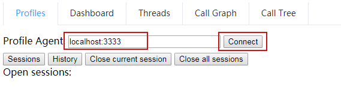
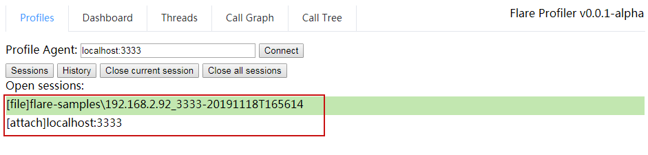
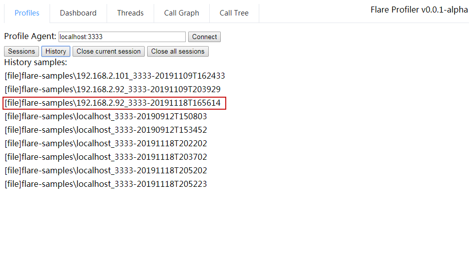
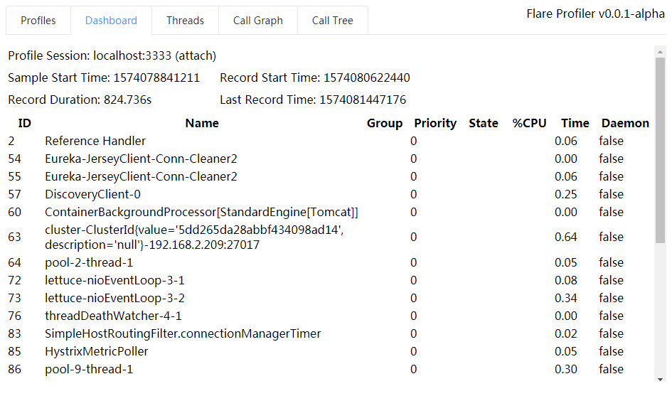
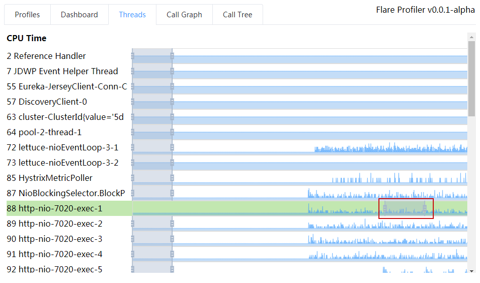
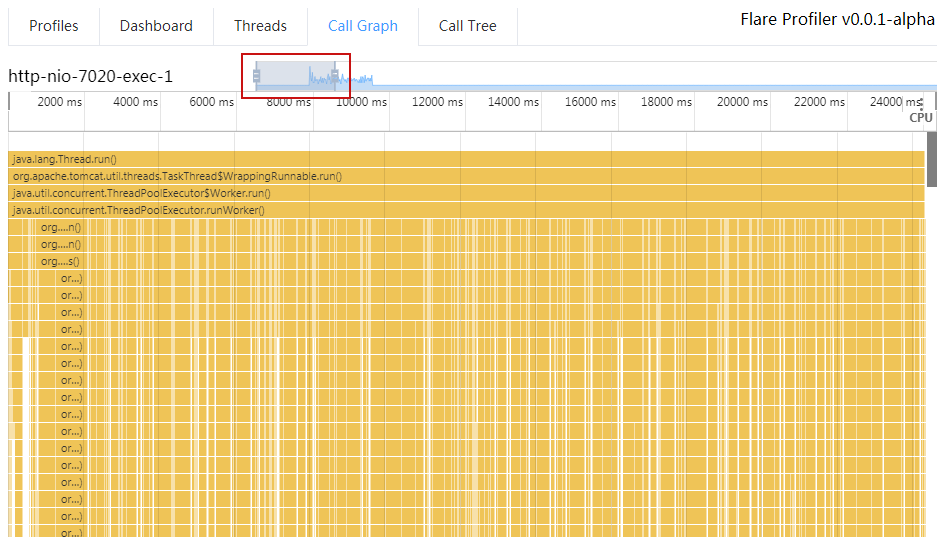
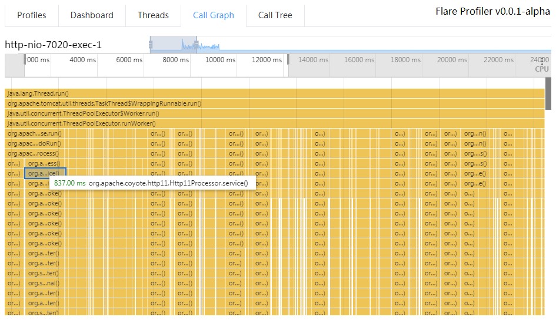
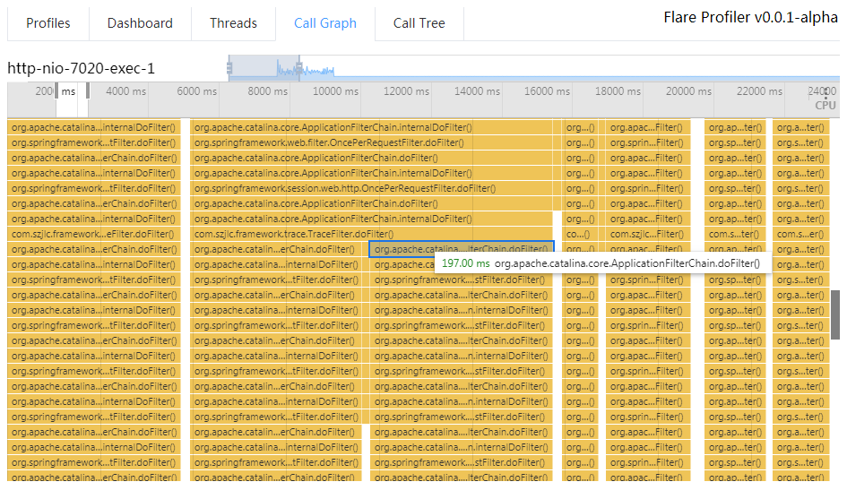
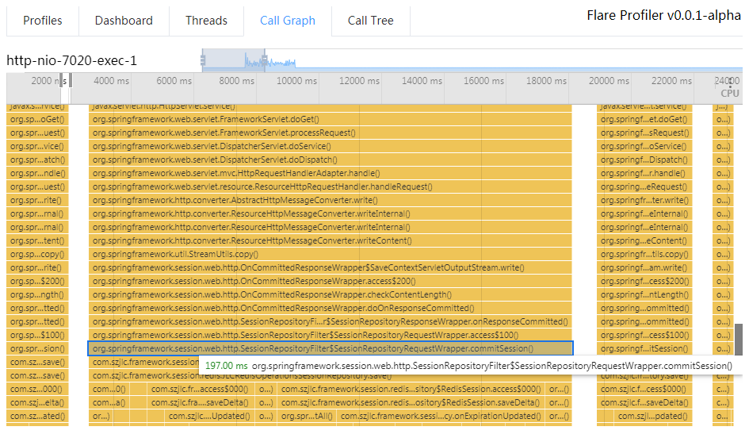

## Java Flare Profiler 入门指南

#### 1. 启动Java应用
启动待分析的Java应用，如Tomcat应用、SpringBoot应用、ElasticSearch、Spark。  
建议启动一个可以压测的Web应用，或者有性能瓶颈的应用。

#### 2. 启动Flare Profiler
##### 2.1) 启动Flare Server
- 在Linux上启动启动Flare Server
```shell script
>wget https://github.com/kylixs/flare-profiler/releases/download/v0.1.0-alpha/flare-profiler-linux-0.1.0-bin.tar.gz
>tar -xvf flare-profiler-linux.tar.gz
>cd flare-profiler
>./start-flare-profiler.sh
Starting flare-server ...
Flare profiler started on port: 0.0.0.0:3891
Http server running on http://127.0.0.1:3890/
```

- 在macOS上启动启动Flare Server
```shell script
>wget https://github.com/kylixs/flare-profiler/releases/download/v0.1.0-alpha/flare-profiler-macos-0.1.0-bin.tar.gz
>tar -xvf flare-profiler-macos.tar.gz
>cd flare-profiler
>./start-flare-profiler.sh
Starting flare-server ...
Flare profiler started on port: 0.0.0.0:3891
Http server running on http://127.0.0.1:3890/
```

- 在Windows上启动启动Flare Server  
下载最新版的flare-profiler-windows.tar.gz程序，解压到某个目录，执行启动脚本：
```shell script
>cd flare-profiler
>start-flare-profiler.bat
Starting flare-server ...
Flare profiler started on port: 0.0.0.0:3891
Http server running on http://127.0.0.1:3890/
```


##### 2.2) 启动Flare Agent
- 在Linux上启动Flare Agent

```shell script
#通过命令找到第1步启动的待分析Java应用的PID，下面的命令结果第二列为Java进程PID: 15110
>ps -ef | grep java
root 15110 15106  0 8月31 ?       12:58:06 /application/jdk/bin/java ....

#启动注入脚本
>cd /pathflare-profiler/agent/
>./bin/start-trace-agent.sh 15110
PROJECT_PATH:/opt/apps/flare-profiler/agent
AGENT_PATH: /opt/apps/flare-profiler/agent/lib/libflareagent.so
AGENT_OPTS: trace=on,interval=5
TARGET_PID: 15110
[root@javasrv07 agent]# [INFO] agentPath: /opt/apps/flare-profiler/agent/lib/libflareagent.so
[INFO] options: trace=on,interval=5

#检查agent端口是否启动成功
>lsof -Pi:3333
COMMAND   PID     USER   FD   TYPE   DEVICE SIZE/OFF NODE NAME
java    15110 xxx_user   76u  IPv4 30791081      0t0  TCP *:3333 (LISTEN)

```
如果执行Agent注入脚本出现错误，请查看[Flare Agent 常见问题](flare-agent-faq.md)

- 在macOS上启动Flare Agent  
请参考上面的小节《在Linux上启动Flare Agent》  
  
  
- 在Windows上启动Flare Agent  
打开CMD窗口，执行以下命令
```
#查找Java进程的PID，第二列为PID
>tasklist | findstr java
java.exe        607040 Console           1    475,920 K

#如果没有设置JAVA_HOME，请设置一下
>echo %JAVA_HOME%
>#set JAVA_HOME=D:\Java\jdk1.8.0_131

#启动注入脚本
>cd flare-profiler/agent/
>bin\start-trace-agent.bat 607040
"AGENT_PATH: D:\projects\xxx\flare-profiler\agent\bin\..\\lib\flareagent.dll"
"AGENT_OPTS: "
"TARGET_PID: 607040"
[INFO] agentPath: D:\projects\xxx\flare-profiler\agent\bin\..\\lib\flareagent.dll
[INFO] options: trace=on,interval=5


#检查agent端口是否启动成功
>netstat -nao |findstr 3333
  TCP    0.0.0.0:3333           0.0.0.0:0              LISTENING       607040
  
```
如果执行Agent注入脚本出现错误，请查看[Flare Agent 常见问题](flare-agent-faq.md)


#### 3. 连接Flare Agent
##### 3.1) 打开Flare UI页面
使用Chrome浏览70+版本以上，访问URL: http://127.0.0.1:3890/    
如果你在无UI界面Linux系统上启动了Flare Server，则改为IP地址访问: http://x.x.x.x:3890  
注意：要设置防火墙允许外部访问 3890(http)及3891(websocket)两个端口。

#### 3.2) 连接Flare Agent
激活"Profile"标签页，修改Profile Agent: 后面的IP和端口，修改为Agent所在系统的IP:3333，点击Connect按钮。  
如果连接Agent成功，会自动激活"Dashboard"标签页，可以看到JVM线程列表。



#### 4. 诊断分析Java服务 
##### 4.1) 查看会话列表及历史存档
激活"Profile"标签页：  
点击"Sessions"按钮，列出当前启动或者加载的会话，绿色背景的会话为当前用户打开的会话，点击其中一个，切换到该会话：  
  
[file] xxxxx 为历史保存的离线文件会话  
[attach] x.x.x.x:3333 为当前已连接的Agent，实时收集分析的会话。实时会话关闭后可以在History中找到。


点击"History"按钮，列出保存的历史会话，点击其中一个，加载该会话，加载成功后"Sessions"列表中会增加一项：  



"Close current session"按钮: 关闭当前打开的会话   
"Close all sessions"按钮: 关闭所有启动的会话 

##### 4.2)查看Dashboard
激活"Dashboard"标签页：  
Profile Session: <当前会话名称>
主要是时间信息和线程列表。


##### 4.3)查看线程CPU时间统计图
激活"Threads"标签页：   
可以看到线程列表及其CPU时间统计图。 
点击某个活动线程的图表中CPU占用较高的位置，如http-nio-xxx，跳转"Call Graph"标签页，分析此线程的方法调用栈。


##### 4.4)分析线程方法调用栈
从"Threads"点击某个线程的图表，自动跳转到"Call Graph"标签页。  
直接打开此标签页没办法指定查看的目标线程。  
拖动线程CPU图表上的范围滑块，可以改变下面的火焰图内容。  
将鼠标移动到火焰图的某个方法上，前后按鼠标滚轮，可以缩放火焰图显示比例，按住鼠标左键拖放可以移动火焰图显示位置。
方法调用栈火焰图的操作方式与Chrome浏览器开发工具中的Performance查看JS方法执行过程相同。  
   
如下图，可以拖动红框的位置，改变下面的内容。  
    

找到比较粗大的方法栈柱子，耗时也多，柱子越大，这个就是性能瓶颈。  
  
  
使用鼠标滚轮放大继续查看  
  

放大并拖动到下面，看到某个方法开始出现了分支，继续定位最大的子分支。这时候仔细看一下，是否有熟悉的包名类名。  
如图所示，这个问题是SpringSession.commitSession()耗时比较多。  
此方法是请求处理完毕后，SpringSession框架自动提交保存会话数据，这个方法慢说明并发保存用户会话可能存在性能瓶颈。
  


#### 5. 停止Flare Profiler
##### 1) 关闭会话
参考4.1，激活"Profile"标签页，点击"Close current session"或者"Close all sessions"按钮。

##### 2) 停止Flare Agent
登录Flare Agent的系统，Linux or macOS系统执行以下命令：
```
>cd flare-profiler/agent/
>./bin/stop-trace-agent.sh <pid>
```

Windows系统执行以下命令：
```
>cd flare-profiler/agent/
>bin\stop-trace-agent.bat <pid>
```

请检查Flare Agent端口是否关闭，参考2.2的检查方法。


##### 3) 停止Flare Server
在flare-server执行的终端窗口上按Ctrl + C，结束进程。

